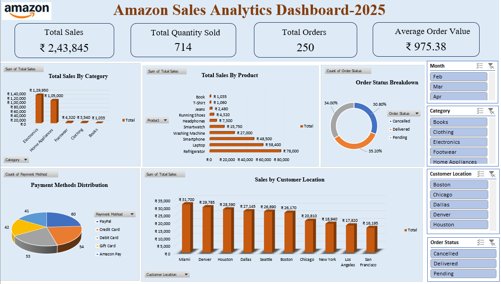

# Amazon Sales Dashboard

## 📌 Project Overview

An Excel-based data analysis project focused on analyzing Amazon order-level sales data to evaluate sales performance, product and category trends, customer locations, payment methods, and order status.

The project covers the complete data analysis workflow, including data cleaning, preprocessing, PivotTable analysis, visualization, KPI development, and interactive dashboard creation.

---

## 🎯 Business Objectives

The analysis aims to answer the following business questions:

- Which products and categories generate the highest sales?
- Which customer locations contribute the most to sales?
- Which payment methods are most frequently used?
- What is the distribution of Delivered, Pending, and Cancelled orders?
- Which customers contribute the highest total spending?

---

## 📊 Dataset

The dataset contains **250 order-level records** with the following fields:

- Order ID
- Date
- Product
- Category
- Price
- Quantity
- Total Sales
- Customer Name
- Customer Location
- Payment Method
- Status

## 🔧 Data Preparation

The following steps were performed in Excel:

- Checked for missing and duplicate records
- Standardized date and numerical formats
- Cleaned text fields
- Validated `Total Sales = Price × Quantity`
- Created Month and Day of Week fields
- Created a standardized Order Status field
- Prepared the data for analysis

---

## 📈 Analysis Performed

PivotTables and PivotCharts were used to analyze:

- Category-wise Total Sales
- Product-wise Total Sales
- Customer Location-wise Total Sales
- Payment Method Usage
- Order Status Distribution
- Top Customers by Total Spending

---

## 🖼️ Dashboard Preview

---

## 🔍 Key Insights

- Total sales generated were **₹243,845** across **250 orders**.
- **714 units** were sold during the analyzed period.
- The average order value was approximately **₹975.38**.
- **Refrigerator** recorded the highest product-level sales.
- **Electronics** generated the highest category-level sales.
- **Miami** recorded the highest sales among customer locations.
- **PayPal** was the most frequently used payment method based on order count.
- Order status analysis recorded **88 Delivered, 85 Pending, and 77 Cancelled orders**.

---

## 🛠️ Tools & Skills

**Tool:** Microsoft Excel

**Skills Demonstrated:**
- Data Cleaning | Data Preprocessing | PivotTables & PivotCharts | KPI Analysis | Excel Slicers | Dashboard Development | Data Visualization | Business Insights

---

## 📝 Conclusion

This project demonstrates the use of Microsoft Excel to transform raw Amazon sales data into meaningful business insights. Through data cleaning, PivotTable analysis, visualization, KPI tracking, and an interactive dashboard, the analysis provides a clear view of sales and order performance.

---

## 👤 Author

**Hema Bonagiri**

Data Analyst | SQL | Python | Excel | Power BI

[LinkedIn]((https://www.linkedin.com/in/hema-bonagiri/)) | [GitHub]((https://github.com/hema-bonagiri))
